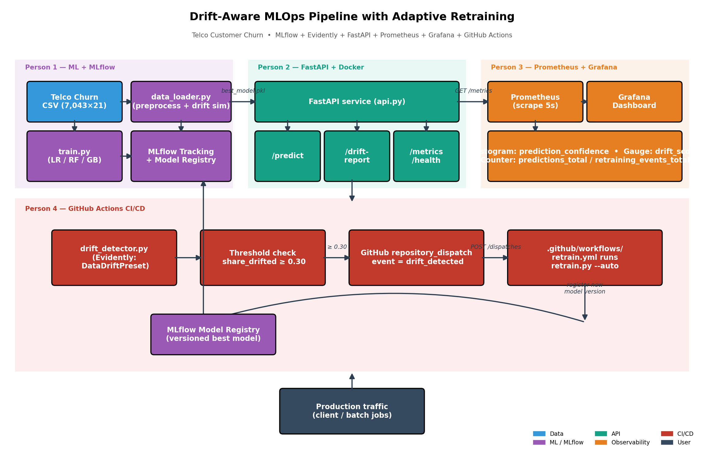
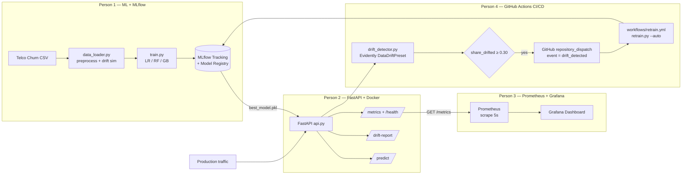

# Drift-Aware MLOps Pipeline with Adaptive Retraining

End-to-end MLOps pipeline for the **Telco Customer Churn** problem that:

- trains and compares multiple models with MLflow tracking + registry,
- exposes prediction and drift-report endpoints via FastAPI,
- detects distribution drift with Evidently AI,
- emits production-grade Prometheus metrics scraped into Grafana, and
- automatically fires a GitHub Actions retraining workflow when drift crosses a threshold.

## Architecture



Mermaid version (renders inline on GitHub):



## Repository layout

```
.
├── api.py                              # FastAPI service (Person 2)
├── data_loader.py                      # preprocessing + drift simulation (Person 1)
├── train.py                            # MLflow training (Person 1)
├── drift_detector.py                   # Evidently + GitHub dispatch (Person 1 + 4)
├── retrain.py                          # adaptive retraining (Person 1 + 4)
├── Dockerfile + .dockerignore          # API container (Person 2)
├── docker-compose.yml                  # API + Prometheus + Grafana stack (Person 3)
├── monitoring/
│   ├── prometheus.yml
│   ├── traffic_gen.py                  # demo-time traffic generator
│   ├── make_architecture_diagram.py    # renders docs/architecture/architecture.png
│   └── grafana/
│       ├── provisioning/{datasources,dashboards}/...
│       └── dashboards/mlops-dashboard.json
├── .github/workflows/retrain.yml       # CI/CD trigger (Person 4)
├── docs/
│   ├── architecture/architecture.png   # system diagram (used in paper)
│   └── screenshots/
│       ├── 01_prometheus_targets.png
│       ├── 02_prometheus_drift_score.png
│       ├── 03_prometheus_predictions_rate.png
│       └── 04_grafana_dashboard.png
├── artifacts/                          # produced by training + drift detection
│   ├── drift_timeline.json
│   ├── retrain_result.json
│   ├── accuracy_over_batches.png       # main paper figure
│   ├── *_classification_report.txt
│   ├── *_confusion_matrix.png
│   └── drift_reports/batch_*_summary.json
├── requirements.txt
└── requirements_api.txt
```

## Setup

```bash
python -m venv venv
source venv/bin/activate        # Windows: venv\Scripts\activate
pip install -r requirements.txt -r requirements_api.txt

# Dataset (not committed — Kaggle license)
# https://www.kaggle.com/datasets/blastchar/telco-customer-churn
# Place at: data/WA_Fn-UseC_-Telco-Customer-Churn.csv
```

## Run order

```bash
# 1. Start MLflow tracking server (separate terminal)
mlflow server --host 0.0.0.0 --port 5000

# 2. Train all models and register the best one
python train.py

# 3. Run drift detection over 5 simulated production batches
python drift_detector.py

# 4. Adaptive retrain — triggers automatically via GitHub Actions in CI,
#    or manually via:
python retrain.py --auto

# 5. Start API
uvicorn api:app --host 0.0.0.0 --port 8000

# 6. Bring up Prometheus + Grafana
docker compose up -d prometheus grafana
# Prometheus: http://localhost:9090
# Grafana:    http://localhost:3000   (admin / admin)
```

A convenience script, `run_all.ps1`, launches MLflow, the pipeline, and the API in
separate Windows PowerShell windows.

## Custom Prometheus metrics (`api.py`)

| Metric | Type | Purpose |
|---|---|---|
| `mlops_predictions_total{churn_label}` | Counter | Predictions made, split by predicted class |
| `mlops_prediction_confidence` | Histogram | Distribution of churn-probability scores |
| `mlops_drift_score` | Gauge | Latest share of drifted features (Evidently) |
| `mlops_drifted_features` | Gauge | Latest count of drifted features |
| `mlops_drift_reports_total{retrain_needed}` | Counter | Drift reports generated, split by retrain decision |
| `mlops_retraining_events_total` | Counter | Increments when `models/best_model_info.json` mtime changes |
| `mlops_last_retrain_timestamp_seconds` | Gauge | Unix timestamp of the most recent retraining event |
| `mlops_model_info{model_name,version}` | Gauge | Currently-loaded model metadata |

## Screenshots (used in the paper)

| File | Description |
|---|---|
| [docs/screenshots/01_prometheus_targets.png](docs/screenshots/01_prometheus_targets.png) | Prometheus scraping the FastAPI `/metrics` endpoint (target healthy) |
| [docs/screenshots/02_prometheus_drift_score.png](docs/screenshots/02_prometheus_drift_score.png) | `mlops_drift_score` over time — alternates between clean (0.17) and drifted (1.0) batches |
| [docs/screenshots/03_prometheus_predictions_rate.png](docs/screenshots/03_prometheus_predictions_rate.png) | `rate(mlops_predictions_total[1m])` split by predicted class |
| [docs/screenshots/04_grafana_dashboard.png](docs/screenshots/04_grafana_dashboard.png) | Provisioned Grafana dashboard with all eight panels |
| [docs/architecture/architecture.png](docs/architecture/architecture.png) | System architecture diagram |

## Drift simulation

`data_loader.simulate_drift` supports four regimes:

| Type | Description |
|---|---|
| `none` | identity (baseline) |
| `gradual` | per-row Gaussian noise that ramps from 0 → `strength` std-devs |
| `sudden` | abrupt mean shift across all numerical features |
| `feature` | shift restricted to a subset of features |

`get_production_batches()` produces 5 batches; batches 0–1 are clean, 2–4 are
drifted with strength `1.5 + 0.3 × i`.

## Key research output

`artifacts/accuracy_over_batches.png` — main paper figure showing accuracy
degrading without retraining (red) vs. recovery with drift-aware retraining
(green) once Evidently fires the threshold.

## MLflow

- Tracking URI: `http://localhost:5000`
- Experiments: `telco-churn-drift-aware`, `telco-churn-drift-detection`, `telco-churn-retraining`
- Model registry: `telco-churn-best-model`

Best model on the run captured in this commit: **gradient_boosting** —
Accuracy 0.8006, F1 0.5670, AUC 0.8414.
